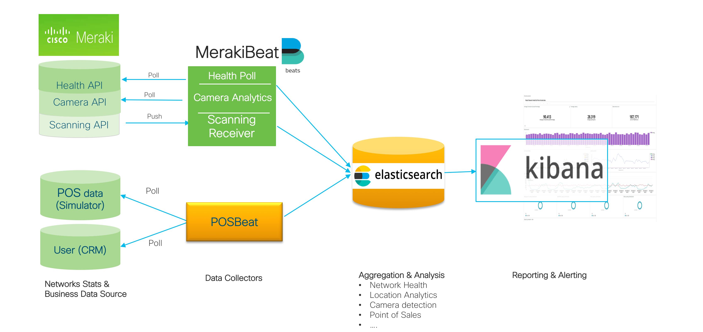
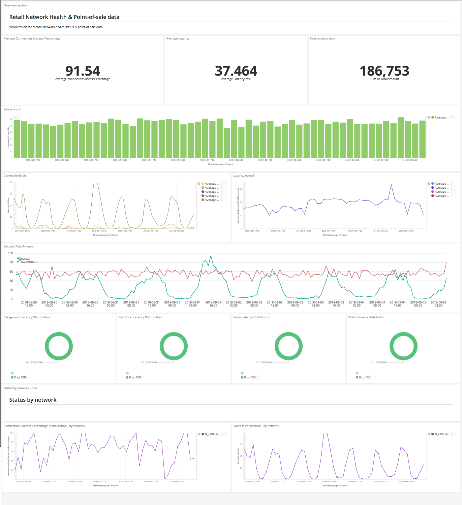
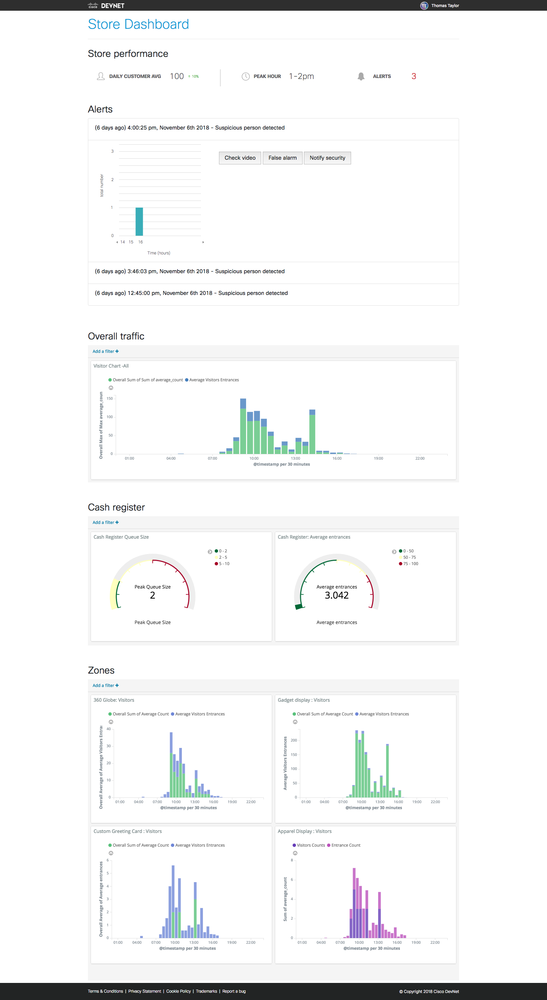

[](https://developer.cisco.com/codeexchange/github/repo/CiscoDevNet/merakibeat)
# Merakibeat

This is elastic beats (https://www.elastic.co/products/beats) plugin for Meraki
health API. Merakibeat plugin enables data collection and analytics pipeline for multiple meraki API.
- Meraki Health API
- Meraki Camera API
- Meraki User Location analytics API
In addition to this project also demonstrate how existing POS of sales data can also added to datasource, so that network health, camera & user analytics data can be used to do combined business analtics.  

#### Meraki exposes health API

(https://dashboard.meraki.com/api_docs#wireless-health) to
identify health of network, devices and client. Some of the key health parameters that
Meraki health API exposes are
- Connection Stats
	- Success : Total number of successful connection
	- Assoc   : Number of connections in Association state
	- Auth	  : Number of connections in Authetication state
	- DHCP 	  : Number of connections in DHCP ip assignmnet stage
	- DNS 	  : Number of connections in DNS check stage   
- Latency Stats : Latency in miliseconds for packet transfer
    - latencyTime: Packet count
	- latencyTime is provided for 2, 4, 8, 16, 32, 64, 128, 256, 512, 1024 & 2048 miliseconds.

This beats plugin polls the Meraki API for these health stats and allows sending Stats
to elasticsearch or any of ouput service supported by
beats. (https://www.elastic.co/guide/en/logstash/current/output-plugins.html).

#### Meraki User Location analytics
The Cisco Meraki Location Analytics API uses intelligent access points to deliver real-time location analytics data directly to customers, allowing integration with 3rd-party retail analytics applications, CRM, and custom-built applications. Merakibeat plugin supports listeners that can collect location analytics data and feed into analytics pipeline.

#### Meraki Camera API
Meraki Camera utilizes a powerful onboard processor to analyze video and provide valuable insights without the need to send those video files to the cloud or a local server. These insight include object/person detection, these insight are also made available to users using camera APIs. Merakibeat camera plugin support collecting information like average person counts and entrances in specific zone. This information can be utilized to identify multiple retails and other campuses scenarios like Queue size, popularity of display rack etc that can be overlayed with POS data.      


This pipeline enables analysing mearki health data with other enterprise data like Point Of Sales,
to identify relation between network status and revenue impact.

## MerakiBeat Data pipeline



 Note: POSBeat plugin mentioned in above diagram is to collect sales data, this is custom non-generic plugin can not be open sourced. POS simulator & posbeat docker images are listed in docker-compose for reference.  

### sample dashboard
Sample kibana dashboards are included as part of docker compose is

#### MerakiBeat health & location analytics API: sample dashboard



#### MerakiBeat Camera API: sample dashboard



# Configuring MerakiBeats plugin
Supports following plugin specific configs in merakibeat.yml file
-  period: Polling interval , recommended value 300s to 600s
-  merakihost: URL for meraki API endpoint in format, http://localhost:5050
-  merakikey: Meraki API key secret
-  merakinewtorkids: Netwroks IDs to be monitored by this plugin format, ["ABC", "XYZ"]
-  merakiorgid: ID of meraki oragnization

Following are fields to control sections that will be collected by data collector
'1' represent data will be collected and '0' means data will be skipped.
- nwconnstat: 1
- nwlatencystat: 1
- devconnstat: 0
- devlatencystat: 0
- clconnstat: 0
- cllatencystat: 0

Following fields can be configured for enabling Meraki location analytics API scan receiver
- scanEnable : 1    
- scanSecret : "simulator"
- scanValidator : "EnterYourValidator"

Following fields can be configured for Meraki Camera APIs
- videoPeriod: Polling interval for camera API
- cameraZoneList: Array of comma separated ["cameraid:zoneid", "cameraid:zoneid"], if user want complete camera data choose zoneid as 0.

All these field are configured in merakibeat.yml config file

#### Meraki Scanning API configuration
 - Meraki scanning receiver is exposed at http://\<baseurl\>:5001/api/v1/scanning/receiver/
	- \<baseurl\> could be http://publicip of host on which meraki beat is or user can configures dns name for assigned IP.
 - This endpoint should be registered in meraki dashboard details can found in this https://documentation.meraki.com/MR/Monitoring_and_Reporting/Scanning_API#Enable_Scanning_API document.
 - Secret and validator from above registration process must be set in above merakibeat config file.

## Running merakibeat
### As docker-composer (**Recommended**)
https://github.com/CiscoDevNet/merakibeat/blob/master/docker-compose/README.md

### As binary
```
merakibeats -e -d *
```

## Building Source code
https://github.com/CiscoDevNet/merakibeat/blob/master/DEVELOPMENT.md
